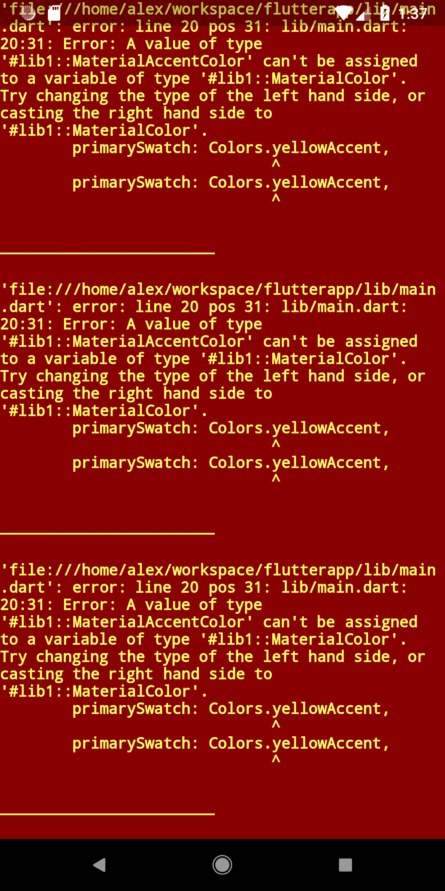

# flutterapp

## why
- AOT compilation for performant production release
- JIT compilation to enable hot (stateful) reloading, better developer UX
- redux bindings: [flutter_built_redux](https://pub.dartlang.org/packages/flutter_built_redux)

## resources
- [FAQ](https://flutter.io/faq/)
- [Flutter for React Native Devs](https://flutter.io/flutter-for-react-native/)
- [Creating Flutter Plugins](https://flutter.io/developing-packages/#plugin)
- [What's Revolutionary about Flutter](https://hackernoon.com/whats-revolutionary-about-flutter-946915b09514#---0-25)
- [Why Flutter Uses Dart](https://hackernoon.com/why-flutter-uses-dart-dd635a054ebf)
- [Flutter's Rendering Pipeline](https://www.youtube.com/watch?v=UUfXWzp0-DU&feature=youtu.be)
- [Build Reactive Native Apps with Flutter](https://www.youtube.com/watch?v=RS36gBEp8OI)
- [Why Doesn't Flutter Use OEM Widgets](https://medium.com/flutter-io/why-flutter-doesnt-use-oem-widgets-94746e812510)
- [state_experiments](https://github.com/filiph/state_experiments)
- [Architecture for Flutter Apps](Architecture for Flutter Apps)
- Dart:
    - https://news.dartlang.org/2012/06/const-static-final-oh-my.html
    - https://www.dartlang.org/

## ramblings

- `flutter doctor` was neat.
- Can easily see the wireframe with `Flutter Inspector > Toggle Debug Paint`
- Ran into this [issue](https://github.com/flutter/flutter/issues/15055), presumably due to the Flutter plugin since vanilla Android Studio didn't have the same issue.
- hot reloading was pretty fast.
- Compilation errors destroy state:

- No nullability checking?
- `NPE` caught by renderer, but the app partially rendered:
```
I/flutter ( 6804): ══╡ EXCEPTION CAUGHT BY RENDERING LIBRARY ╞═════════════════════════════════════════════════════════
I/flutter ( 6804): The following NoSuchMethodError was thrown during performLayout():
I/flutter ( 6804): The getter 'asPascalCase' was called on null.
I/flutter ( 6804): Receiver: null
I/flutter ( 6804): Tried calling: asPascalCase
```
- not a fan of the deep `Widget` nesting that comes naturally when writing a `build` method
